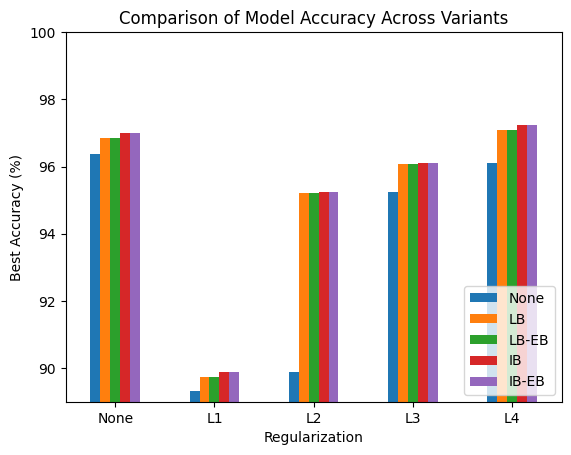
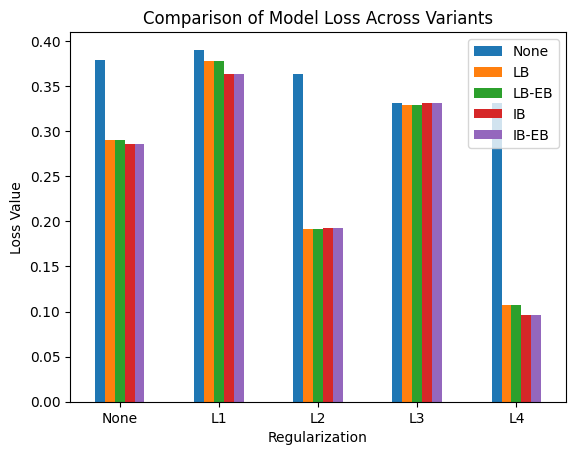
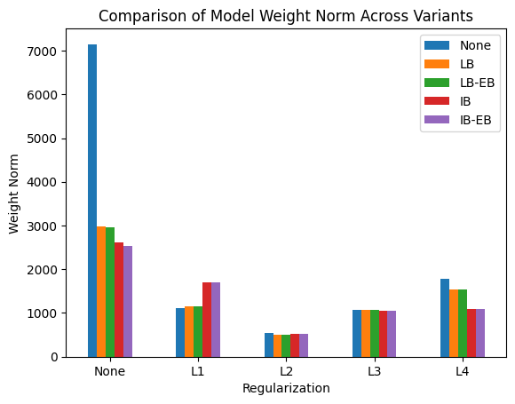
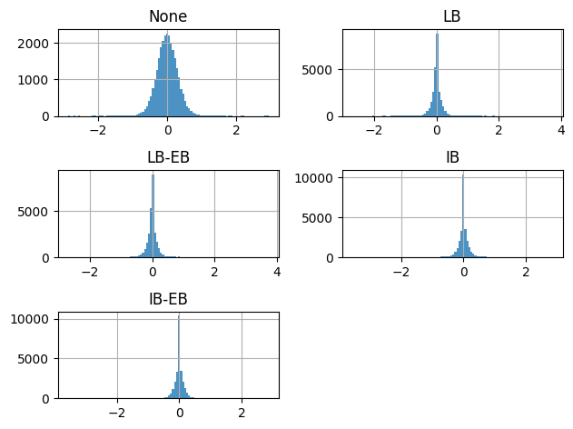

# Neural Balancing Adam Optimizer (NB-Adam)

This repository contains the implementation and experimental results for the paper "Neural Balancing Adam Optimizer (NB-Adam)" authored by J.P. Yoo and Pierre Baldi. The paper introduces a novel optimizer that incorporates synaptic balancing into the training of neural networks, improving both accuracy and stability over standard optimization methods.

## Overview

The NB-Adam optimizer modifies the traditional Adam optimization algorithm by including a balancing mechanism that ensures the Euclidean norms of incoming and outgoing weights at each neuron are equal throughout training. This self-regularizing feature enhances model performance significantly, particularly in complex neural network architectures.
## Algorithm

Here is the pseudocode for the NB-Adam optimizer:

```plaintext
Algorithm: NBAdam Optimizer Update Method
1: class NBAdamOptimizer:
2:     def __init__(self, η, decay, ε, β₁, β₂):
3:         self.learning_rate = η
4:         self.decay = decay
5:         self.epsilon = ε
6:         self.beta₁ = β₁
7:         self.beta₂ = β₂
8: 
9:     def update(self, layers, iterations, period = 100, balance_type=None, include_bias=False):
10:         lr = self.learning_rate * (1. / (1. + self.decay * iterations))
11:         for layer in layers:
12:             if not hasattr(layer, 'weight_cache'):
13:                 Initialize momentum and cache arrays to zeros
14:             Update momentum for weights and biases
15:             Correct momentum using bias correction factor
16:             Update cache with squared gradients
17:             Correct cache using bias correction factor
18:             Adjust weights and biases using corrected values and learning rate
19:             if balance_type and iteration % period == 0:
20:                 Balance weights based on some balance criteria
```

## Repository Structure

- `model.py`: Implementation of the model definitions and creations.
- `loss.py`: Implementation of the Loss and Regularizations.
- `optimizer.py`: Implementation of the NB Adam Optimizer.
- `torch-compatible-optimizer.py`: Implementation of the NB Adam Optimizer, compatible with torch modules.
- `train.py`: Scripts and results from experiments conducted to test the efficacy of NB-Adam.
- `data/`: Data used for experiments, including MNIST dataset samples.
- `figures/`: Generated plots and figures to visualize the results and performance metrics.
- `LICENSE`: The license file.

## Getting Started

### Prerequisites

- Python 3.x
- pip

### Installation

1. Clone the repository:
   ```bash
   git clone https://github.com/your-username/nb-adam.git
   cd nb-adam
   ```
   
### Usage

Run the experiment scripts located in the main.py:
  ```bash
  python main.py
  ```

## Experimental Results and Observations

The NB model, which lacks any balancing or regularization mechanism, achieved a Validation Accuracy of 96.38% and a Validation Loss of 0.38. Introducing any regularization reduced the validation accuracy, while some regularization reduced the validation loss.

### Figures and Tables

#### Best Accuracy Comparison


*Figure: Best Accuracy Comparison among different models with and without regularization.*

| Model      | None  | LB    | LB-EB | IB    | IB-EB |
|------------|-------|-------|-------|-------|-------|
| None       | 96.38 | 96.85 | 96.85 | 97.01 | 97.01 |
| L1         | 89.33 | 89.73 | 89.73 | 89.89 | 89.89 |
| L2         | 89.89 | 95.22 | 95.22 | 95.25 | 95.25 |
| L3         | 95.25 | 96.08 | 96.08 | 96.11 | 96.11 |
| L4         | 96.11 | 97.08 | 97.08 | 97.25 | 97.25 |

Interestingly, models that incorporate balancing operations show enhanced adaptability without traditional weight regularization. The IB model achieved a Validation Accuracy of 96.85% and a Validation Loss of 0.29. Similarly, the LB-EB model recorded a Validation Accuracy of 96.71% and a Validation Loss of 0.29. These findings suggest that neural balancing operations play a crucial role in preventing overfitting and guiding models towards the optimal loss region for the validation data.

#### Best Loss Comparison


*Figure: Best Loss Comparison across models under different regularization conditions.*

| Model      | None  | LB    | LB-EB | IB    | IB-EB |
|------------|-------|-------|-------|-------|-------|
| None       | 0.38  | 0.29  | 0.29  | 0.29  | 0.29  |
| L1         | 0.39  | 0.38  | 0.38  | 0.36  | 0.36  |
| L2         | 0.36  | 0.19  | 0.19  | 0.19  | 0.19  |
| L3         | 0.33  | 0.33  | 0.33  | 0.33  | 0.33  |
| L4         | 0.33  | 0.11  | 0.11  | 0.10  | 0.10  |

All balancing models reached higher peak accuracies compared to the NB models under all regularization conditions. Moreover, the balancing models without regularization have achieved the second-best accuracies and losses, followed by the balancing models with L4 regularization.

### Weight Norm Analysis


*Figure: Weight Frobenius Norm Comparison across different models.*

| Model      | None      | LB       | LB-EB    | IB       | IB-EB    |
|------------|-----------|----------|----------|----------|----------|
| None       | 7148.35   | 2983.67  | 2951.39  | 2613.74  | 2539.07  |
| L1         | 1117.49   | 1161.85  | 1161.85  | 1692.54  | 1692.54  |
| L2         | 533.20    | 495.99   | 495.99   | 527.98   | 527.98   |
| L3         | 1072.87   | 1066.92  | 1066.92  | 1058.96  | 1058.96  |
| L4         | 1777.25   | 1531.93  | 1531.93  | 1094.48  | 1094.48  |

The balancing models exhibited significant improvements in weight regularization, indicating the effectiveness of balancing operations in regulating synaptic weights across different models and conditions.

### Parameter Regularization Impact

The balancing operation has successfully decreased the total weight Frobenius norm across all experiments. The most notable reductions occurred in models without weight regularization, as demonstrated in the following figure:


*Figure: Weight Histogram without Regularization showing the impact of the balancing operation.*

Models trained with a regularization term generally had weight norms centered around zero. While L1, L2, and L3 regularizations effectively reduced the Frobenius weight norm, they also decreased model accuracy. Since the weight distributions were already centered around zero, changes in the histograms were minimal, and the norm reduction was modest, as observed from previous figures. However, the balancing operation consistently enhanced the discounted accuracy and lowered the validation loss for all regularized models, indicating its effectiveness in not just maintaining but improving model performance across various regularization settings.

## Contributing

Contributions to improving NB-Adam are welcome! Please feel free to submit pull requests or open an issue if you have suggestions or find bugs.

## License

This project is licensed under the MIT License - see the [LICENSE](LICENSE) file for details.

## Contact

- J.P. Yoo - jpyoo@uci.edu

We hope this optimizer aids in your research and practical applications!
```

This README provides essential information about the project, setup instructions, usage details, and contribution guidelines, aimed at helping users and potential collaborators understand and engage with your work effectively. Adjust the repository structure and sections as needed to align with your project's specifics.

We hope this optimizer aids in your research and practical applications!

